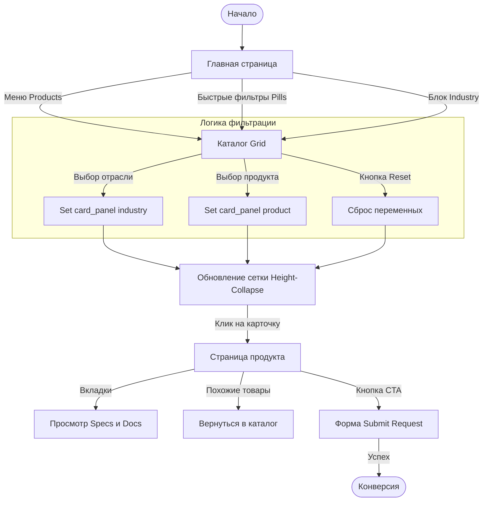

## User Flow/System Logic
1. Поиск решения через отрасль
	`Home (Industry Block)` → `Click "Metallurgy"` → `Catalog (Auto-filtered: Metallurgy)` → `Select Product` → `Product Page` → `Submit Request`
2. Поиск конкретного оборудования
	`Home (Quick Filters)` OR `Header Menu (Products)` → `Catalog (Full View)` → `Apply Filters (Sidebar)` → `Select Product` → `Product Page` → `Download PDF` / `Request Quote`
3. Прямой переход (Deep Link)
	`External Link / Search Engine` → `Product Page` → `View Specs` → `Submit Request`─ "Privacy Policy(?)"

## (Sitemap)
1.  **Главная страница** (Home)
    *   Hero Block (Заголовок + CTA "Get in touch")
    *   Quick Filters (Pills: Density, Level, Flowmeters...) — *быстрый вход в каталог*
    *   Industry Solutions (Список отраслей с переходом в каталог с фильтром)
    *   About / Capabilities / Certificates (Имиджевые блоки)
    *   Footer (Навигация, контакты, соцсети)

2.  **Каталог продукции** (Catalog)
    *   Sidebar (Фильтры: Industry_radio + products_checkboxes)
    *   Product Grid (Динамическая сетка карточек)
    *   Search Bar (Поиск по названию/тегам)
    *   *Логика:* Многомерная фильтрация через переменные высоты (Height-Collapse hack).

3.  **Страница продукта** (Product Page)
    *   Breadcrumbs (Хлебные крошки: Products > Category > Name)
    *   Hero Section (Фото + Краткое описание + CTA "Request a Quote")
    *   Tabs (Description / Specifications / Installation / Documentation)
    *   Lead Form (Submit a Request — справа или внизу)
    *   Related Products (Блок похожих товаров)

4.  **Служебные страницы** (не реализованы)
    *   Privacy Policy (Политика конфиденциальности — обязательна для форм, но пока не реализована)
    *   404 Not Found (Страница ошибки - пока не реализована)
## Каталог продукции: Итоговый баланс (25 карточек)
##### По продуктам:
*   **Samplers:** 7 шт.
*   **Thickness:** 4 шт.
*   **Analyzers:** 6 шт. (Analyst, Visco, CTRL, CTRL Pro, Moisture, Micro)
*   **Density:** 4 шт. (Mega d23, STD, Pulp Density, Food Density)
*   **Level:** 1 шт. (iLevel-137)
*   **Flowmeters:** 3 шт. (AERO-Round, AERO-Rect, Mag)
##### По отраслям:
*   **Mining:** 3 шт. (inTexa-45, 20, Cross)
*   **Metallurgy:** 6 шт. (inTexa-90, R4, IT-GP-Tr1, Tr10, LaserPoint, LaserScan)
*   **Chemical:** 3 шт. (inTexa-60, Analyst, AERO-Rect)
*   **Pulp & Paper:** 6 шт. (Belt Sampler, 90 Sampler, Moisture, Micro, Pulp Density + 1 доп.)
*   **Oil & Gas:** 3 шт. (Mega d23, inTexa-STD, Mag Flow Meter)
*   **Food & Beverage:** 5 шт. (Visco, CTRL, CTRL Pro, Food Density, iLevel-137, AERO-Round)

## Логика прототипа (Technical Implementation)
*   **Сайдбар (Industry):** Radio-buttons. При клике устанавливает `card_panel` в название отрасли и сбрасывает продуктовые чеки в "inactive".
*   **Сайдбар (Products):** Checkboxes. При клике устанавливают `card_panel` в "product" и сбрасывают отраслевые радио в "false".
*   **Height-Collapse Hack:** Вместо скрытия слоев (оставляющего дырки в Auto Layout), используется изменение высоты карточки до `0px` через переменные `_card_H`. Это обеспечивает честную перестройку сетки без JS.
*   **Reset:** Сбрасывает всё в дефолтное состояние (Full Catalog).

## Полный список карточек каталога
### 1. Samplers (7 карточек)

| № | Модель | Описание (EN) | Теги | Примечание |
| :--- | :--- | :--- | :--- | :--- |
| 1 | inTexa-45 Sampler | Automatic representative sampling for pipelines and tanks without process interruption. | mining, samplers | Базовая модель, вертикальный поток |
| 2 | inTexa-60 Sampler | Pneumatically driven integral sampler for vertical pipelines. Features self-cleaning nozzles. | chemical, samplers | Пневматика, самоочистка |
| 3 | inTexa-90 Sampler | Heavy-duty automatic representative sampling for large-diameter pipelines and tanks. | pulp & paper, samplers | Мощная версия, горизонтальная труба |
| 4 | inTexa-20 Sampler | Compact overflow sampler for low-flow gravity chutes. Enclosed housing prevents splashing. | mining, samplers | Компактный, перелив |
| 5 | inTexa-R4 Sampler | Rotary sampler-reducer for pulp and bulk solids. Handles pipes Ø50–1200mm. | metallurgy, samplers | Роторный сократитель |
| 6 | inTexa-Cross Sampler | Automatic cross-cut sampler for conveyor transfer points. Ensures representative sampling. | mining, samplers | Для точек пересыпки |
| 7 | inTexa-Belt Sampler | Automatic cross-cut sampler for conveyor belts. Features screw-conveyor discharge. | pulp & paper, samplers | Установка на ленту |
### 2. Thickness Gauges (4 карточки)

| № | Модель | Описание (EN) | Теги | Примечание |
| :--- | :--- | :--- | :--- | :--- |
| 8 | IT-GP-Tr1 Gauge | C-frame isotope gauge for continuous pipe wall thickness measurement. Roll-out design. | metallurgy, thickness | Одноточечный, трубы |
| 9 | IT-GP-Tr10 System | 10-point O-frame system for full-profile pipe inspection. Combines isotope + laser. | metallurgy, thickness | Многолучевой, профиль |
| 10 | LaserPoint-7K Gauge | Next-gen single-point laser gauge for flat rolled products. Precise thickness control. | metallurgy, thickness | Лазерный, плоский прокат |
| 11 | LaserScan-7K System | Multi-axis scanning system for strip profile control. Measures flatness in real-time. | metallurgy, thickness | Сканирующий, коробление |

  ### 3. Analyzers (6 карточек)

| № | Модель | Описание (EN) | Теги | Примечание |
| :--- | :--- | :--- | :--- | :--- |
| 12 | inTexa-Analyst System | Online elemental analyzer for conveyor belts. Real-time composition monitoring. | chemical, analyzers | Онлайн-анализ состава |
| 13 | inTexa-Visco Analyzer | Inline process analyzer for viscous food masses. Monitors consistency and temperature. | food & beverage, analyzers | Для вязких масс |
| 14 | inTexa-CTRL System | Centralized automation panel for food processing lines. Integrates sampling/dosing. | food & beverage, analyzers | Шкаф управления |
| 15 | inTexa-CTRL Pro | Programmable process controller with HMI interface. Manages batching/heating cycles. | food & beverage, analyzers | Контроллер с экраном |
| 16 | inTexa-Moisture Gauge | Compact under-belt microwave moisture analyzer. Ideal for limited space. | pulp & paper, analyzers | Установка ПОД лентой |
| 17 | inTexa-Micro Gauge | C-frame microwave moisture gauge for conveyor belts. Non-contact humidity analysis. | pulp & paper, analyzers | Установка НАД лентой |
### 4. Density Meters (4 карточки)

| № | Модель | Описание (EN) | Теги | Примечание |
| :--- | :--- | :--- | :--- | :--- |
| 18 | Mega d23 Density Gauge | Non-contact isotope gauge for real-time density and thickness measurement. | oil & gas, density | Базовый плотномер |
| 19 | inTexa-STD Gauge | Universal non-contact gauge for liquids, slurries, and emulsions. High precision. | oil & gas, density | Универсальный |
| 20 | inTexa-Pulp Density | High-precision density meter for paper stock and pulp slurry. Consistent basis weight. | pulp & paper, density | Для бумажной массы |
| 21 | inTexa-Food Density | Hygienic density sensor for liquid food products. Monitors Brix/fat content. | food & beverage, density | Гигиеничное исполнение |
### 5. Level Sensors (1 карточка)

| № | Модель | Описание (EN) | Теги | Примечание |
| :--- | :--- | :--- | :--- | :--- |
| 22 | iLevel-137 Sensor | Universal isotope level gauge for tanks and vessels of any shape. Stable non-contact. | food & beverage, level | Изотопный, емкости |
### 6. Flowmeters (3 карточки)

| № | Модель | Описание (EN) | Теги | Примечание |
| :--- | :--- | :--- | :--- | :--- |
| 23 | AERO-Round Flow Sensor | DP flow sensor for round pipelines. Integrated flow straightener grid. | food & beverage, flowmeters | Для круглых труб |
| 24 | AERO-Rect Flow Sensor | DP flow sensor for rectangular ducts. Multi-point averaging Pitot tubes. | chemical, flowmeters | Для коробов/воздуховодов |
| 25 | inTexa-Mag Flow Meter | Hygienic electromagnetic flow meter for conductive liquids. Precise batching. | oil & gas, flowmeters | Электромагнитный |